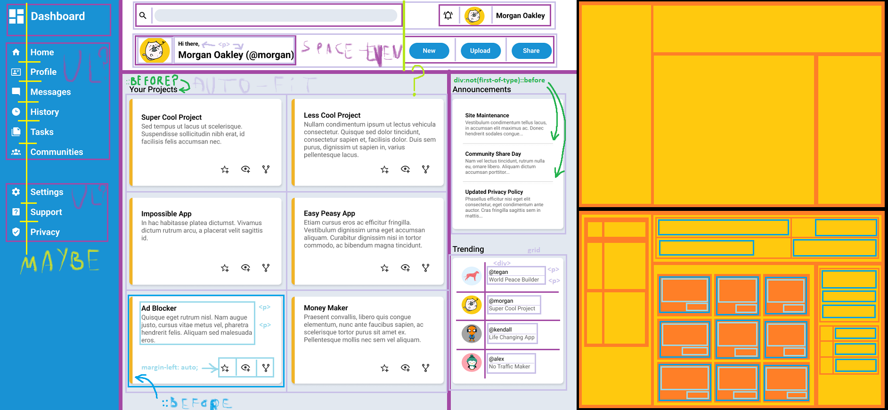
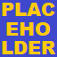
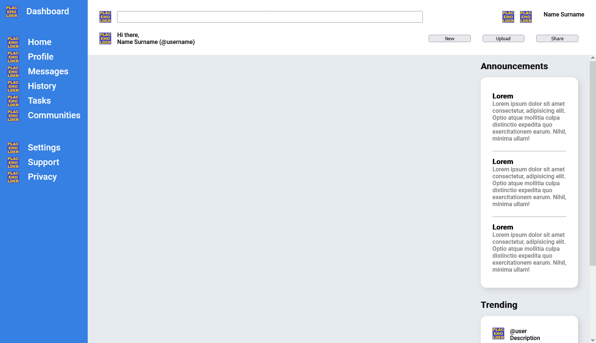
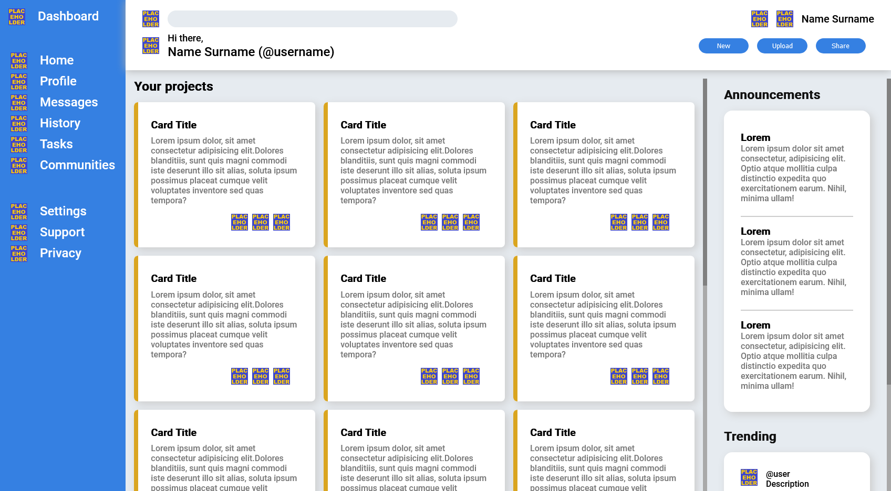
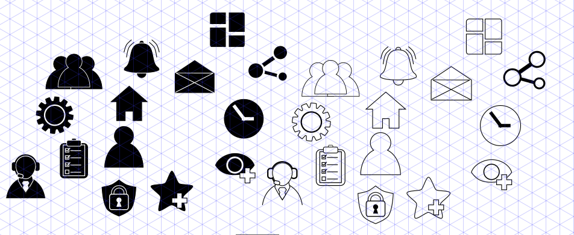
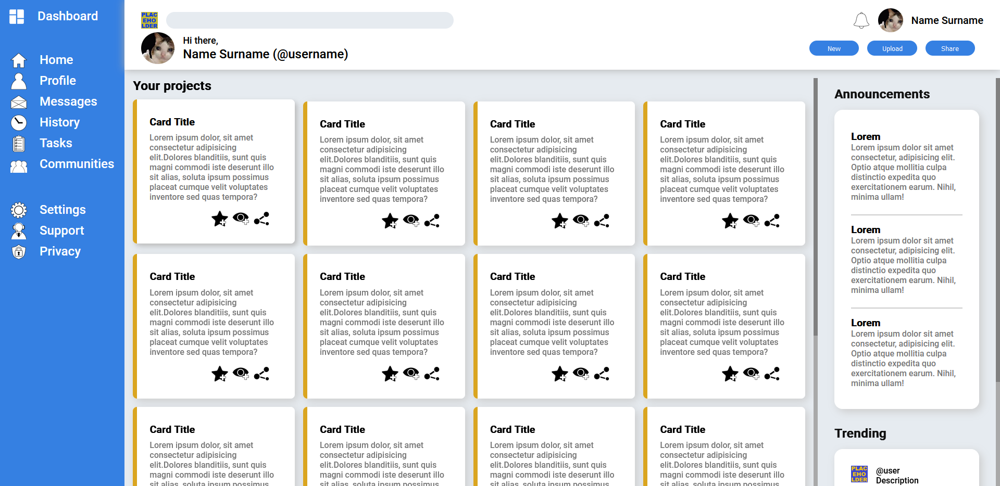
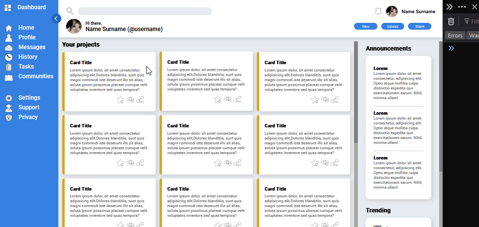
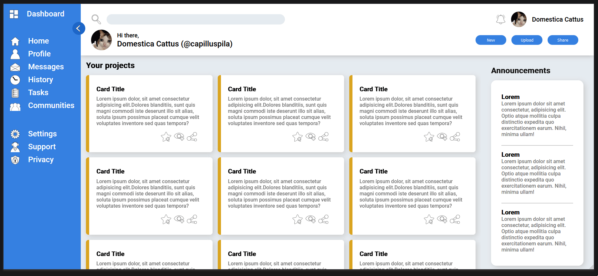

# odin-dashboard

## live:
## https://hectorvilas.github.io/odin-dashboard/

---

Welcome to my new project! This time I'm making a dashboard using a mix of `Grid` and `Flex`. The objective is to replicate this reference image:


It looks simple but already can see the challenges. I've been planning how to achieve something like this, scribbling on it with MS-Paint:



At the left I marked my guessings. I've drawn lines over the original image to get a better idea of how I should divide everything. Sorry in advance for my handwriting with mouse.

At the right there's a simplified version I drew, to make it easier to understand what I had planned: at the top there is the basic structure: nav bar, header, main and whatever you call the announcements and trending section. at the bottom I added the divisions on each main section, using orange for `Grid` and blue for `Flex`.

First I was messing around, scribbling all over the reference image, but I ended with something that I'm pretty sure will make the developing smoother, so that's a good start.

There's no need to replicate the image as is. I'm not sure if I'm going to do it, but maybe it would be the best, because in a real job I guess I'll be following the UX/UI team's design instead of making my own.

As always, I'll be updating this README.md file with my progress. I've said in my [previous repository](https://github.com/HectorVilas/odin-form) that I will write everything on spanish (my native language) and english, but that was a lot of unnecesary extra work, so I'll stick with english only, at least for Odin's practice projects.

# progress

## update 1
I started with the basic boilerplate and made `<body>` a grid container. I don't know why others put a new `<div>` inside `<body>` when `<body>` is there. If I find this is a bad practice, I'll move it's `CSS`' properties to a new `<div>` container.

The first thing I did was dividing the grid in 3 columns and 2 rows, I think this is the minimum necessary for the main layout.

Then I started with the dashboard, the skyblue sidebar at the left. I thought I needed flex items with `display: grid`, but I managed to make it all grid. My approach was using `<ul>` for each section and `<li>` for each item. It also was useful for spacings.

As I didn't had any icons, I made a quick placeholder image in MS-Paint (ugly, but will do for now), so I'm using it each time I want to progress without stopping for icons:



As I learned in previous lessons, I did this to scale the placeholders:

```css
.dashboard [src*="placeholder"] {
  width: 32px;
}
```

This way no styling will be applied to the new icons once I replace the image source. I'm planning to make them on InkScape, designing my own icons or trying to replicate the ones in the reference image.

### next steps:

My next step will be the navigation section, the top one. It's already divided, I just need to place the items and I'm planning to use flex on each cell, sounds more appropiate than grid here.

## update 2
I've been working in the navigation (top) and info (right) bars. Nothing special have been done here, just tried to follow the design from the reference image. I thought I would need to use `::before` in some elements, but an `<h2>` was enough, grid took care of this, without extra divs.

There's nothing special to tell about this part. I just applied some `justify-self` and `align-self` in the top bar, nothing new in the rest of the objects. I think I'll need an extra cell to space along the cross axis, or maybe set a max value and let them stop growing in certain point, then `space-evenly`.

The top bar have ugly spacing on widescreen and the side bar will shrink too much on a narrow window. I need to remember to make use of `minmax()` and `clamp()`.

This is how the page looks for now:



The font is roboto, from Google Fonts, the same used in the reference image. As the right bar was too tall, I added `overflow-y: auto` to it's `CSS`.

### next steps:

My next step will be the cards in the main section, here I'm planning to use `auto-fill` with `space-evenly`. I don't like how the cards look when they change size dynamically, looks ugly, so I may set with a static width and height, or at least a `minmax()`, then let the spacing between cards be dynamic.

I've been slower than I'm comfortable with, I hope I get faster next time I try to make a website with lots of elements.

## update 3
Today I've been working in the main section. With a little magic, AKA:

```css
grid-template-columns: repeat(auto-fit, minmax(300px, 1fr));
```

I made it dynamic. At first I used a static value, letting the spacing between cards be the dynamic part, but it looked bad. Making the viewport wider or narrower added huge gaps before adding a new column track, so I used the recommended `minmax()` for dynamic cards.

I've also been working in the general styling. The elements in the header bar now have a `minmax()` and an extra empty column in the middle, so the elements will space away instead of getting extra-wide.

I don't remember exactly the rest of the adjustments, so here is a screenshot of how it's going:



### next steps:

Now it's time to draw my own icons with InkScape, I don't want to download free icons (which would be faster for the development), but only because I want to get better with this software.

I also want to try to imagine my own designs, but as I'm not an UX/UI guy, I may just try to replicate those from the reference image.

Once I have the page done, I should start making it (partially) functional. It's not necessary for the practice, I just want it to do something.

## update 4
I've spent 3 hours on InkScape making some vectorial icons. Here is the result:



I made the dark ones first, then inverted most of the fills and outlines for a light theme, but it won't be necessary, as the `CSS`' filter `invert()` does exactly the same job. I could make a dark theme, removing the color inversion, withow the need of extra icons.

After that, I put the icons in the page. It doesn't look professional, but I'm happy to be able to draw my own icons.



I also used the "thumbs up crying cat" meme as avatar, for now.

### next steps:
The page is almost done. I need to replace the search and Trending's avatars placeholders, then this project is tecnically done.

I should make it responsive, make the sidebar toggleable (hide text, keep icons), make the search functional, toggle dark and light theme, whatever I can come up with, no matter if it's not part of the practice.

## update 5
Today I decided to replace all the icons with the light mode. It was absurd to have the colors inverted by default. I also added a little button near the top at the right of the navigation bar, to toggle text visibility.

After this I decided it's time to do something about the responsiveness. Now when the viewport is 1500 pixels wider or less, the nav bar will show icons only, and the button to change it's size will be hidden. Once it gets 900 pixels wider or less, the right bar (announcements and trending) will be hidden. I think I screwed up here with the `HTML`/`CSS`, because the way I wrote it, I can't make the right bar to appear at the bottom of the main section. Maybe there's a simple way to achieve it but I'm not seeing it, or maybe I should rearrange some stuff in the `HTML`.

Another little change was replacing the `::before` object in each card with a background gradient. Now the golden border can have any width without modifying the border radius.

Here is a little GIF showing the toggleable nav bar and it's responsiveness:


### next steps:
• try to not hide completely the info bar (the right one) or make it toggleable

• shrink the header, rearranging in 1 row 3 columns

• hide the greeting message ("Hi there, ...") because it's not needed.

## update 6
Today I added the missing images (I just searched for cat memes), now all placeholders are replaced.

I've also been working in the responsiveness. Now the page can be used with a 400% zoom, or with a really small size:



Of course, it is possible just because the page is not functional. There's no options, no prompts, no nothing, just the page and it's contents in place, because that's the practice and nothing else.

### next steps:

I wanted to make the search bar functional, but I would need actual text for the cards. I'll leave it alone, I know how to make it functional with or without regEx. The next time will be.

I want to try to make a dark theme. Place a button somewhere to change the page colors and apply `invert()` to icons.